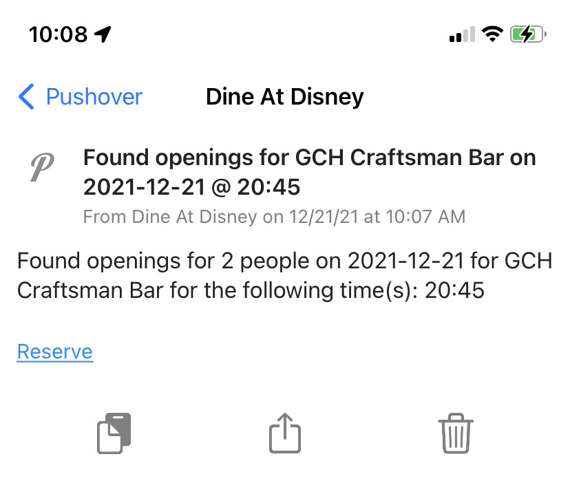

# dine-at-disney 🍽 🎆

A CLI tool for checking dining reservation availability at Disneyland / California Adventure.

## Features

- See a list of all restaurants that offer reservations.
- Search for availability across all restaurants, or narrow your query to specific places.
- Continually monitor a restaurant for availability, and receive email/push notifications when an opening is found.

## Prerequisites

- **Node.js >= 20.12**
- **Playwright + Chromium** — installed automatically as a dependency. The tool launches Playwright's bundled Chromium browser to interact with Disney's website and bypass Akamai bot detection. The browser binary is downloaded automatically when you run `npm install`. If it wasn't (e.g. you skipped scripts), run `npx playwright install chromium` manually.
- **A MyDisney account** — you'll be prompted to log in on first run. Your session is saved to `~/.dine-at-disney-auth.json` so you won't need to log in every time.

## Installation

```sh
npm install -g dine-at-disney
```

This will also automatically download the Chromium browser binary that Playwright needs. If the download is skipped for any reason, run:

```sh
npx playwright install chromium
```

## How it works

Disney's dining reservation site uses Akamai bot detection, which blocks direct API requests. This tool uses [Playwright](https://playwright.dev/) to drive a real Chrome browser (minimized in your dock), filling out Disney's search form and intercepting the API responses. When polling for a specific restaurant, it uses a hybrid approach — fast in-page API calls when possible, with automatic fallback to a full UI-driven search when Akamai intervenes.

## Usage

### First run — authentication

On first run (or when your session expires), a Chrome window will open and prompt you to log in to your MyDisney account. Once login is detected, the session is saved automatically. Subsequent runs reuse the saved session.

### List restaurants and their IDs

```sh
dine-at-disney list
```

Sample output:

```
Fetching restaurant list...
| Name                                                   | ID       | Location              |
| ------------------------------------------------------ | -------- | --------------------- |
| Blue Bayou Restaurant                                  | 354099   | Disneyland Park       |
| Cafe Orleans                                           | 354117   | Disneyland Park       |
| Carnation Cafe                                         | 354129   | Disneyland Park       |
| Carthay Circle Lounge - Alfresco Dining                | 16588263 | Disney California Adv |
| Carthay Circle Restaurant                              | 16515009 | Disney California Adv |
| Catal Restaurant                                       | 354132   | Downtown Disney Dist  |
...
```

### Search for openings at any restaurant

```sh
dine-at-disney search --date 2026-03-15 --party 2
```

`--date` defaults to today if omitted. `--party` defaults to 2.

You can filter the results to a specific time window using `--startTime` and `--endTime` (e.g., `--startTime "08:00" --endTime "1:00 PM"`). 
You can also provide just one of these options to search from a specific time onwards (e.g., `--startTime "5:00 PM"`) or up until a specific time (e.g., `--endTime "12:00 PM"`).

By default, the browser runs minimized in your dock. Add `--show-browser` to watch it interact with Disney's site (useful for debugging):

```sh
dine-at-disney search --date 2026-03-15 --party 2 --show-browser
```

Sample results:

```
Found some offers on 2026-03-15:
| Name                               | ID       | Available Times                        |
| ---------------------------------- | -------- | -------------------------------------- |
| Catal Restaurant                   | 354132   | 5:00 PM (Dinner)                       |
| GCH Craftsman Bar                  | 19343532 | 6:45 PM (Dinner), 8:00 PM (Dinner)    |
| Goofy's Kitchen                    | 354261   | 7:35 PM (Dinner)                       |
| River Belle Terrace                | 354450   | 5:30 PM (Dinner), 2:30 PM (Lunch)     |
```

When searching all restaurants (no `--ids`), results are displayed once and the program exits.

### Monitor a specific restaurant

This will poll every 60 seconds and use [notification](#notifications) hooks if configured.

```sh
dine-at-disney search --date 2026-03-15 --party 2 --ids 19013078 --startTime "5:00 PM"
```

Sample output:

```
Checking for tables for 2 people on 2026-03-15 from 5:00 PM onwards for IDs: 19013078...
No offers found for restaurant ID 19013078.
Checking again in 60s. 1 total attempts.
🎉 Found offers at 5:30 PM, 7:00 PM for Lamplight Lounge!
   👉 Book now: https://disneyland.disney.go.com/dine-res/restaurant/19013078
Checking again in 60s. 2 total attempts.
```

### Monitor multiple specific restaurants

```sh
dine-at-disney search --date 2026-03-15 --party 2 --ids "354261,354450"
```

### Notifications

Notifications are triggered when monitoring specific restaurants (using `--ids`) and availability is found.

#### Mail alerts

See `.env.example` for info on the required fields for email alerting.

Copy those values into your own `.env` file.

#### Pushover alerts

For more information see: [https://pushover.net/](https://pushover.net/)

This service is a one time $5 fee forever. You can purchase a Pushover API token here: [https://pushover.net/pricing](https://pushover.net/pricing). Once setup you will get instant push notifications to your device when a table opens.

Additionally you can click the reserve link in the push notification to reserve the table.



See `.env.example` for info on the required Pushover fields.

Copy those values into your own `.env` file.
